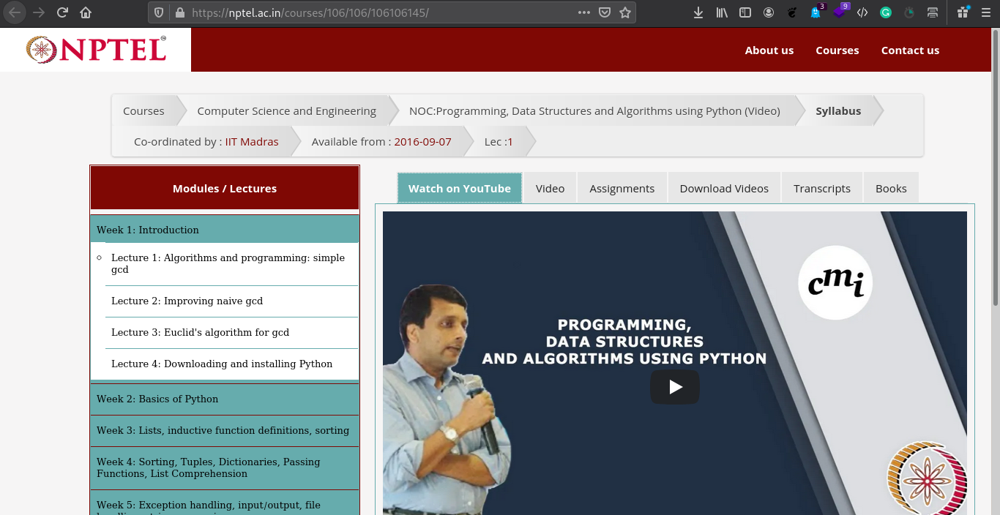
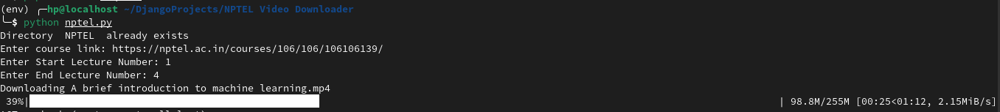

# NPTEL Video Offline Downloader
#### Using Python

Download whole course videos with one simple python script.

## How to use
1. Install Python
2. Install required Libraries using `pip install -r req.txt`
3. Run `nptel.py`
4. Enter URL like [https://nptel.ac.in/courses/106/106/106106145/](https://nptel.ac.in/courses/106/106/106106145/)

5. Enter starting number of lecture
6. Enter ending number of lecture
   
7. Wait till download completes
8. All the downloads will be saved to `NPTEL` folder in same directory